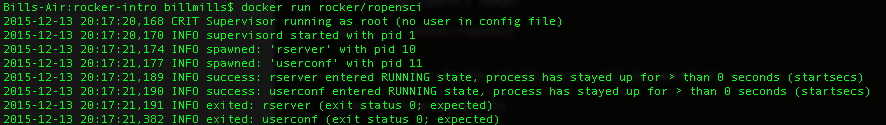

# Introduction to Rocker

This tutorial introduces [Docker](https://www.docker.com/), a system for transferring the dependencies and operating system configuration of our code to another user. We'll focus on [Rocker](https://github.com/rocker-org/rocker/wiki), a collection of Docker configurations intended for use with R and RStudio. No experience with Docker is required for this tutorial, but readers will need to know how to move around the bash shell; if `cd`, `ls`, `rm`, and `cp` look familiar, you're all set; if not, check out [this fine lesson first](http://swcarpentry.github.io/shell-novice/). We'll be referring to a number of R packages as well, but explicit knowledge of them is absolutely not required.

## 1. Why Are We Doing This?

The open science movement has made much lately about the importance of open source code to reproducible research; by sharing our code, we help make sure the methodology that produced our results is recorded and available for future use, and we collectively build up a toolbox of useful stuff for our disciplines to use, so we aren't starting from zero on every new project. This is all great stuff, but there's just one problem: *code does not run in a vacuum*. In order to actually run that open source code at some time in the future, we need to be able to recreate the *context* that code ran in, which means the operating system environment and all the dependencies that code relied on.

[Fighting with dependencies](https://en.wikipedia.org/wiki/Dependency_hell) is boring, and can be difficult; nobody wants to sink hours (days) into sorting out which version of which package is needed to reproduce their results. That's where Docker comes along: Docker is a system that lets us take a snapshot of all those dependencies, and transfer that snapshot to a colleague (or, usually, to ourselves, years later). If a git repo captures our code, then a *Docker image* captures that code's context. Docker accomplishes this by packaging up an operating system and all those dependencies in a linux container, which if you're using a non-linux machine runs on a virtual machine - containerization jargon aside, think of it as creating a tiny virtual computer you can hand to someone else to run your code with.

We'll also see how Docker dramatically increases the *flexibility* of our running environments; in the past, labs would get bogged down by being unable to update their computers, lest they smash all the carefully tuned dependencies they were running under; by capturing those dependencies in a Docker image, we can swap in and out of a set of dependencies without worrying about breaking anything. Again, like version control for code, a Docker image allows us to always go back - allowing us to experiment fearlessly with our software.


## 2. Getting Set Up

First things first: **install Docker**: on [Linux](https://docs.docker.com/linux/step_one/), [Mac](https://docs.docker.com/mac/step_one/), or [Windows](https://docs.docker.com/windows/step_one/). These install guides link to a bunch of introductory material after installation is complete; it's not necessary to complete those tutorials for this lesson, but they are an excellent introduction to basic Docker usage.

Next up, **download the `rocker/ropensci`** base image. As we'll learn in the next section, Docker images are built up in layers, and we always start with something called a *base image*, which contains the really fundamental stuff to our code's context: the base operating system, and some core dependencies. `rocker/ropensci` contains:

 - Debian linux as the base operating system
 - the entire Hadleyverse
 - all [rOpenSci](https://ropensci.org/) packages currently on CRAN
 - RStudio.

If you're on Mac or Windows, in the last step you installed something called the *Docker Quickstart Terminal*; open that up now - it should look like just a plain shell prompt, but really it's pointing at a linux virtual machine that Docker likes to run in, and this is where you should do everything for the rest of this tutorial unless otherwise noted. If you're on a linux machine, then you can just use a plain old terminal prompt. Make a clean working directory and install the base image by doing:

```
mkdir rocker-tutorial
cd rocker-tutorial
docker run rocker/ropensci
```

 **This is a 3GB download**, so now would be a good time for more coffee; also, when it's done, it'll look like it's just hanging:

 

That's ok - this base image automatically launches a live web server to serve RStudio from, which we'll play with in a minute. If you see some messages like those depicted, everything worked; press `ctrl-c` to kill the server.

Last step: **find the IP RStudio is going to be posted at.**

**Mac or Widnows:**

```
docker-machine ls
```

The IP address is in the `URL` column; we want just the IP, which is whatever is between the `//` and the `:`; so for example, the previous command gives me:

```
Bills-Air:rocker-intro billmills$ docker-machine ls
NAME      ACTIVE   DRIVER       STATE     URL                         SWARM   ERRORS
default   *        virtualbox   Running   tcp://192.168.99.100:2376  
```

So my IP address would be `192.168.99.100`. Keep this handy - we'll need it in the next step.

**Linux**

At you command prompt, do

```
docker inspect --format '{{ .NetworkSettings.IPAddress }}' $(docker ps -q)
```


## 3. Working With Docker

### 3.1: The Base Image

In the last section, we downloaded a Docker image that contains a base operating system (Debian), and a whole lot of interesting and useful R packages all pre-installed. Fire it up:

```
docker run -dp 8787:8787 rocker/ropensci
```

then in your favorite web browser, visit `IP:8787`, where `IP` is the IP you found out in the setup step above - and et voila, there's RStudio! Enter `rstudio` as both the user name and password, and you'll have RStudio up and running in your browser. Even better, try loading your favorite hadleyverse or ROpenSci library in the RStudio terminal:

```
library('dplyr')
```

`dplyr` and all its friends are already pre-installed in the base image you downloaded above. What about `gapminder`?

```
library('gapminder')
```

Rats - no gapminder! That package isn't part of the base image. In the next section, we'll learn how to start adding things on top of our base images. First, let's shut down this running Docker image; at the docker terminal, list running images:

```
docker ps -a
```

You can kill a running container via its ID:

```
docker kill 3fbe7049ca80
```

where `3fbe7049ca80` is whatever you saw under the `CONTAINER ID` column in the previous command. Shut down containers can be removed:

```
docker rm 3fbe7049ca80
```

and for power users, you can shut down and remove all running containers with a bit of shell:

```
docker rm -f $(docker ps -a -q)
```

### 3.2 Building Up an Image: The Dockerfile

In the last section, we got started with a base image, and learned how to manage our containers a bit; but, we quickly found that we wanted to add more stuff on top of our base image, like `gapminder`. To do so, we need to learn about Dockerfiles.

Dockerfiles are a set of instructions on how to add things to a base image. They build custom images up in a series of *layers*. In a new file called `Dockerfile` in your `rocker-tutorial` directory, put the following:

```
FROM rocker/ropensci:latest
```

This tells Docker to start with the `rocker/ropensci` base image - that's what we've been using so far. The `FROM` command must always always always be the first thing in your Dockerfile; this is the foundation of the house you are building.

Next, let's add another layer on top of our base, in order to have `gapminder` pre-installed and ready to go:

```
RUN wget https://cran.r-project.org/src/contrib/gapminder_0.1.0.tar.gz
RUN R CMD INSTALL gapminder_0.1.0.tar.gz
```

`RUN` commands in your Dockerfile execute shell commands. In this example, the first line downloads the gapminder source from CRAN, and the second line installs it. Save that file, and return to your docker terminal; we can now build our image by doing:

```
docker build -t my-r-image .
```

`-t my-r-image` gives our image a name (note the name must include at least one `-`), and the `.` says all the resources we need to build this image are in our current directory. List your images via:

```
docker images
```

and you should see `my-r-image` in the list. Launch your new image similarly to how we launched the base image:

```
docker run -dp 8787:8787 my-r-image
```

Then in the RStudio terminal, try gapminder again:

```
library('gapminder')
gapminder
```

And there it is - gapminder is pre-installed and ready to go in your new docker image. As noted in the previous section, we can shut down and remove all our running containers in one command:

```
docker rm -f $(docker ps -a -q)
```

### 3.3: Accessing Files and Data

Now that we've built a custom Docker image, we'd like to have it interact with some code. Remember, Docker is running inside an isolated container on your computer; it doesn't automatically have access to *anything* that you didn't set up inside the image. Luckily, Docker made it really easy to *mount* (associate) a directory on your physical computer with one on your isolated Docker image. First, copy the following R script into a file called `gapminder-plot.R` in your `rocker-tutorial` directory (thanks [Jenny Bryan](https://github.com/jennybc)):

```
library("gapminder")

aggregate(lifeExp ~ continent, gapminder, median)
##   continent lifeExp
## 1    Africa 47.7920
## 2  Americas 67.0480
## 3      Asia 61.7915
## 4    Europe 72.2410
## 5   Oceania 73.6650

suppressPackageStartupMessages(library("dplyr"))
gapminder %>%
    filter(year == 2007) %>%
    group_by(continent) %>%
    summarise(lifeExp = median(lifeExp))
## Source: local data frame [5 x 2]
## 
##   continent lifeExp
## 1    Africa 52.9265
## 2  Americas 72.8990
## 3      Asia 72.3960
## 4    Europe 78.6085
## 5   Oceania 80.7195

library("ggplot2")
ggplot(gapminder, aes(x = continent, y = lifeExp)) +
  geom_boxplot(outlier.colour = "hotpink") +
  geom_jitter(position = position_jitter(width = 0.1, height = 0), alpha = 1/4)
```

Add another parameter to your command to launch a container:

```
docker run -dp 8787:8787 -v {Path-to-rocker-tutorial}:/home/rstudio/ my-r-image
``` 

where `{path-to-rocker-tutorial}` is the full path to your `rocker-tutorial` directory (if you're not sure, do `pwd` in your `rocker-tutorial` directory, and copy-paste the result you get). This will make whatever is visible in your `rocker-tutorial` directory visible inside RStudio running in your Docker image. 

Go back into RStudio in your browser, and you should see the contents of `rocker-tutorial` in the file tab of RStudio's explorer pane; click on `gapminder-plot.R` to load it, and run the whole thing via Code -> Run Region -> Run All, and the figure from gapminder's docs is reproduced. Also note, this figure is produced using `ggplot2` - one of the dependencies we had pre-installed from the base Rocker image.

> **Protip: Separating Code and Dependencies**

> We just saw how we can encapsulate dependencies in a docker image, and expose some local code on our machine to run in that context; presumably that local code could be a git repository. While we'll see in the next section how to include files right in our Docker image, in general it may be a good idea to keep these things separate; code typically changes much faster than dependencies, and you might not want your Docker image to change every time you change your code. By mounting code externally like we just did, we maintain separation of powers: git for code, Docker for context.

### 3.4 Packaging Up Files in our Image

One other thing that might be useful, is packaging up not only dependencies, but perhaps some static files inside our Docker image. As noted above, it might be best to avoid packaging code that changes frequently along with your image (though there are certainly many exceptions to this 'rule'); but if there are files you want every user of your dependency stack to have in the same way every time, you can include them in your image via the `ADD` command in your Dockerfile. 

Make a new file called `data.dat` inside your `rocker-tutorial` directory, and put whatever you like in it; then, add the following lines to your Dockerfile:

```
ADD data.dat /home/rstudio/
```

Rebuild your Docker image:

```
docker build -t my-r-image .
```

And launch it again, this time leaving off the filesystem mounting:

```
docker run -dp 8787:8787 my-r-image
```

Go back to RStudio in the browser, and there `data.dat` will be, hanging out in the files visible to RStudio. In this way, we can capture files as part of our Docker image, so they're always available along with the rest of our image in the exact same state.

> **Protip: Cached Layers**

> While building and rebuilding your Docker image in this tutorial, you may have noticed lines like this:
> ```
Step 2 : RUN wget https://cran.r-project.org/src/contrib/gapminder_0.1.0.tar.gz
 ---> Using cache
 ---> fa9be67b52d1
Step 3 : RUN R CMD INSTALL gapminder_0.1.0.tar.gz
 ---> Using cache
 ---> eeb8ef4dc0a8
> ```
> Noting that a cached version of the commands was being used. When you rebuild an image, Docker checks the previous version(s) of that image to see if the same commands were executed previously; each of those steps is preserved as a separate layer, and Docker is smart enough to re-use those layers if they are unchanged and *in the same order* as previously. Therefore, once you've got part of your setup process figured out (particularly if it's a slow part), leave it near the top of your Dockerfile and don't put anything above or between those lines, particularly things that change frequently; this can substantially speed up your build process. 


## 4. Conclusion

In this tutorial, we learned how to take a base image, and layer extra dependencies and files on top of it to make a custom, portable virtual computer that can run our code reliably just about *anywhere*. We are now ready to do all kinds of cool stuff:

 - Notice how it's possible to have plenty of different Docker images on your computer, and it's pretty easy to start and stop them; by encapsulating our dependencies in these Docker images, we can quickly swap between dependencies without uninstalling / reinstalling things every time. For Python folks, this is similar to a [Conda environment](http://conda.pydata.org/docs/using/envs.html) - but Docker is completely language agnostic, making this power available to everyone.
 - Docker also supports something called [Dockerhub](https://hub.docker.com/) - much like GitHub, this service allows you to share your Docker images with your collaborators.
 - Amazon Web Services has [extensive Docker support](http://docs.aws.amazon.com/AmazonECS/latest/developerguide/docker-basics.html), meaning that if you need a bunch of computing power quickly and cheaply, Docker can provide you with a reliable way to transport your running environment from your computer to theirs.
 - Similarly to AWS, [Travis CI also supports Docker](https://docs.travis-ci.com/user/docker/). In my experience, one of the hardest things about continuous integration is getting my code to run on their computers; again, Docker gives us a clean way to run code anywhere.


## 999. Command Cheat Sheet

What containers are hanging around?
```
docker ps -a
```

Kill a running {container}:
```
docker kill {container}
```

Remove an old {container}:
```
docker rm {container}
```

Kill and remove ALL containers:
```
docker rm -f $(docker ps -a -q)
```

Find IP of {container}:
```
docker inspect --format '{{ .NetworkSettings.IPAddress }}' {container}
```

What images do I have locally?
```
docker images
```

Delete an {image}:
```
docker rmi {image}
```
